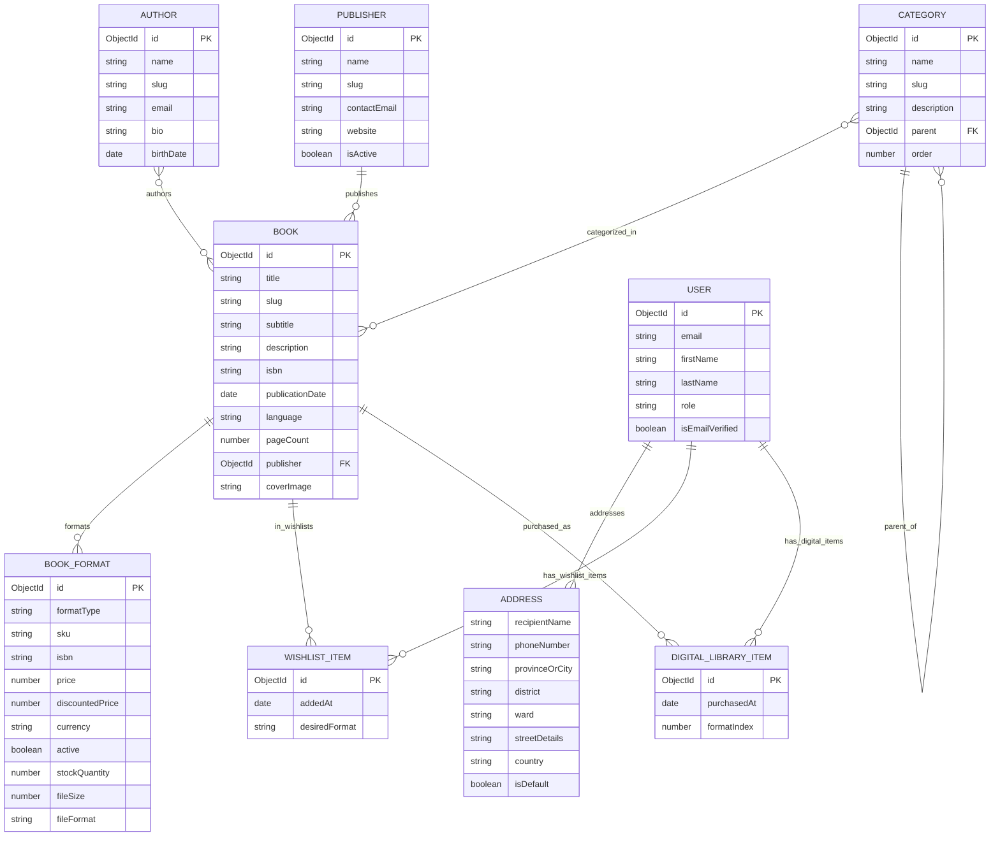

```mermaid
erDiagram
    AUTHOR {
        ObjectId id PK
        string name
        string slug
        string email
        string bio
        date birthDate
    }

    BOOK {
        ObjectId id PK
        string title
        string slug
        string subtitle
        string description
        string isbn
        date publicationDate
        string language
        number pageCount
        ObjectId publisher FK
        string coverImage
    }

    PUBLISHER {
        ObjectId id PK
        string name
        string slug
        string contactEmail
        string website
        boolean isActive
    }

    CATEGORY {
        ObjectId id PK
        string name
        string slug
        string description
        ObjectId parent FK
        number order
    }

    USER {
        ObjectId id PK
        string email
        string firstName
        string lastName
        string role
        boolean isEmailVerified
    }

    BOOK_FORMAT {
        ObjectId id PK
        string formatType
        string sku
        string isbn
        number price
        number discountedPrice
        string currency
        boolean active
        number stockQuantity
        number fileSize
        string fileFormat
    }

    ADDRESS {
        string recipientName
        string phoneNumber
        string provinceOrCity
        string district
        string ward
        string streetDetails
        string country
        boolean isDefault
    }

    WISHLIST_ITEM {
        ObjectId id PK
        date addedAt
        string desiredFormat
    }

    DIGITAL_LIBRARY_ITEM {
        ObjectId id PK
        date purchasedAt
        number formatIndex
    }

    %% Relationships
    AUTHOR }o--o{ BOOK : "authors"
    PUBLISHER ||--o{ BOOK : "publishes"
    CATEGORY }o--o{ BOOK : "categorized_in"
    CATEGORY ||--o{ CATEGORY : "parent_of"
    BOOK ||--o{ BOOK_FORMAT : "formats"

    USER ||--o{ ADDRESS : "addresses"

    %% Wishlist / purchases modeled as subdocuments referencing Book
    USER ||--o{ WISHLIST_ITEM : "has_wishlist_items"
    BOOK ||--o{ WISHLIST_ITEM : "in_wishlists"

    USER ||--o{ DIGITAL_LIBRARY_ITEM : "has_digital_items"
    BOOK ||--o{ DIGITAL_LIBRARY_ITEM : "purchased_as"

    %% Note: Many-to-many relationships (Author-Book, Book-Category, User-Book via wishlist/purchases)
    %% are represented as join/subdocument entities where appropriate.
```